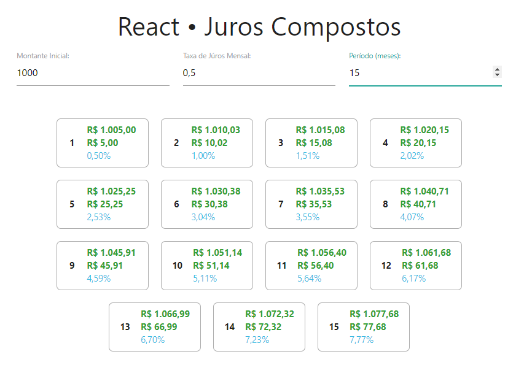

Projeto desenvolvido no Bootcamp do IGTI [Meu primeiro bootcamp]

### Objetivo
Criar uma página que calcula os Juros de um montante ao decorrer dos meses informados.

### Tecnologias usadas
Javascript, React.js, Node.js e Materialize.css

### Projeto

